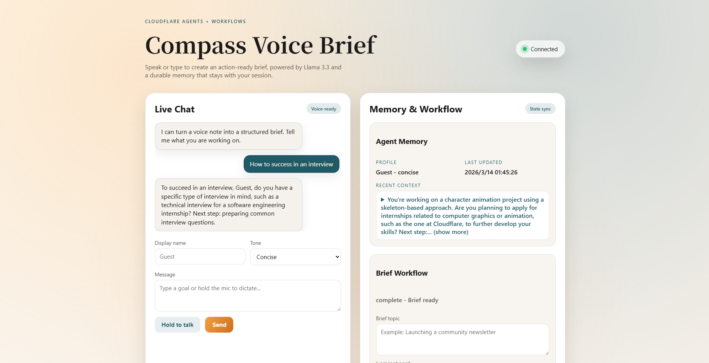

# Compass Voice Brief

An AI-powered Cloudflare Agents app that turns chat or voice notes into structured action briefs. It uses Llama 3.3 on Workers AI, a Workflow for multi-step brief generation, and Durable Object-backed Agent state for memory.

## Overview

- **LLM**: Uses Llama 3.3 on Workers AI via `env.AI.run()`.
- **Workflow / coordination**: A `BriefWorkflow` (Cloudflare Workflows) orchestrates a multi-step outline + brief pipeline.
- **User input**: Browser UI supports chat plus voice dictation (Web Speech API) and connects over the Agents Client SDK.
- **Memory / state**: The Agent persists profile, history, and last brief in durable state and syncs it to clients.



## Key files

- `src\agent.ts`: Agent logic, LLM calls, memory/state, workflow hooks.
- `src\workflow.ts`: Workflow steps that generate the outline and brief.
- `public\app.js`: Voice + chat UI and AgentClient wiring.

## Local development

```
npm install
npm run dev
```

Open the URL shown by Wrangler (typically http://127.0.0.1:8787).

## Deploy

```
npm run deploy
```

Then open the link printed by Wrangler (usually `https://cf-ai-voice-brief.<username>.workers.dev`).

## Technology stack

- Cloudflare Workers + Workers AI (Llama 3.3) for serverless LLM inference
- Cloudflare Agents SDK with Durable Objects for stateful agent memory
- Cloudflare Workflows for multi-step AI coordination (outline + brief pipeline)
- Cloudflare Pages/Workers static assets for the UI
- TypeScript for backend logic and shared types
- Vanilla JavaScript + Web Speech API for chat + voice input
- Wrangler CLI for local dev and deployment
